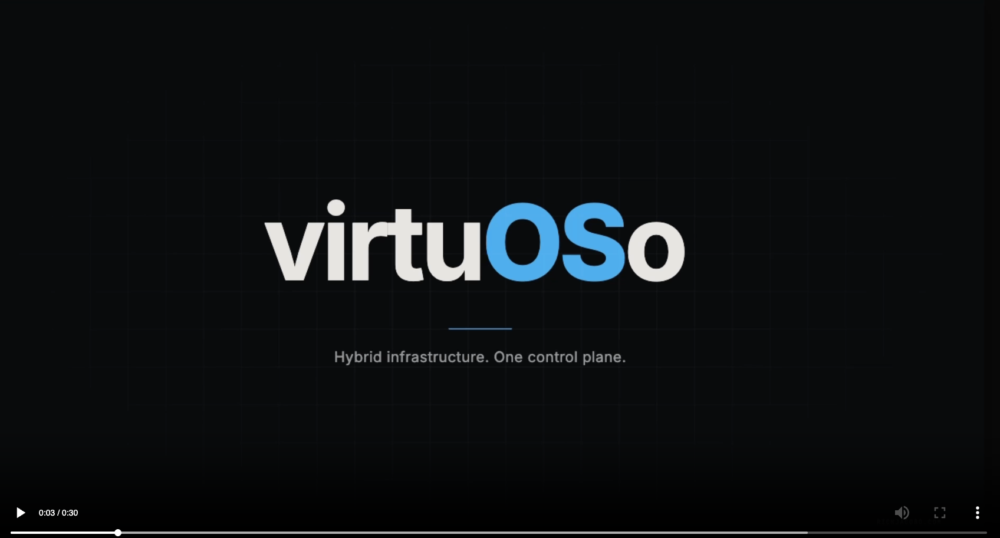
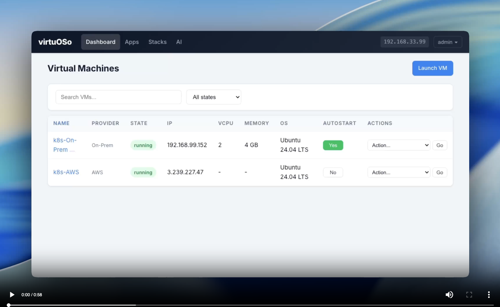

# virtuOSo

**A hybrid infrastructure management platform for homelabs and cloud.**

[](https://youtu.be/AWbEG4mrLws)
virtuOSo manages VMs across on-prem KVM and AWS EC2 from a single dashboard. Launch cloud and local VMs side-by-side, deploy apps from a built-in marketplace, and automate everything through a REST API, Terraform provider, or AI assistant. Ships as a custom Ubuntu ISO for bare metal install, with optional AWS provider for cloud instances.

**Project Website:**  
https://rickjacobo.com/virtuoso.html

## Features

- **Hybrid Cloud** — Manage on-prem KVM and AWS EC2 instances from the same UI
- **Web Dashboard** — Launch, monitor, and manage VMs from any browser
- **Web Shell & Console** — SSH, serial, and VNC access directly in the browser
- **Apps Marketplace** — One-click deployment of Kubernetes, Docker, Gitea, databases, and monitoring stacks
- **Custom Images** — Boot from cloud images, uploaded ISOs, or QCOW2 disk images (Linux and Windows)
- **VPN Integration** — Built-in Tailscale support for secure remote access
- **Stacks** — Deploy multi-VM environments from declarative YAML templates
- **REST API** — JSON endpoints for full programmatic control
- **Terraform Provider** — Infrastructure-as-code VM management
- **AI Assistant** — Built-in Claude integration with MCP tool access
- **CLI** — Full command-line interface for scripting and automation
- **Multi-User** — Role-based access control with admin and user roles
- **Custom ISO** — One-step bare metal install on any x86_64 machine

[](https://www.youtube.com/watch?v=dpxVXJt2tAE)


## Install

[Download the latest ISO](http://releases.rickjacobo.dev/virtuoso.iso), write it to a USB drive, and boot your server:

```bash
curl -LO http://releases.rickjacobo.dev/virtuoso.iso
sudo dd if=virtuoso.iso of=/dev/sdX bs=4M status=progress oflag=sync
```

After installation, the web UI is available at `https://<server-ip>`.

## Upgrade

From a running virtuOSo server:

```bash
vm upgrade
```

Or via script:

```bash
curl -sSL https://raw.githubusercontent.com/rickjacobo/virtuoso-releases/main/upgrade.sh | bash
```

## Requirements

**On-prem (ISO install):**
- x86_64 machine with Intel VT-x or AMD-V (for KVM)
- 4 GB+ RAM recommended (host + VMs)

**AWS (optional):**
- AWS account with EC2 and VPC access
- Credentials configured via Settings page
